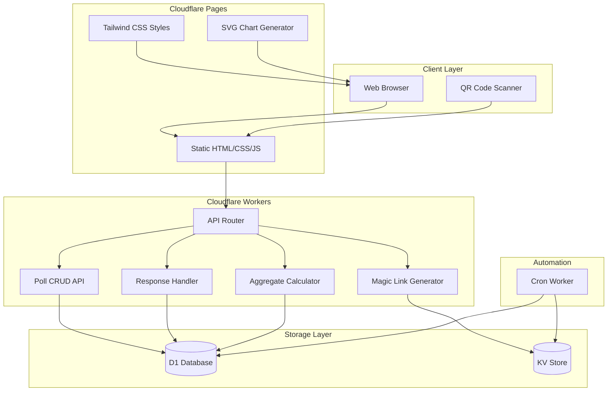
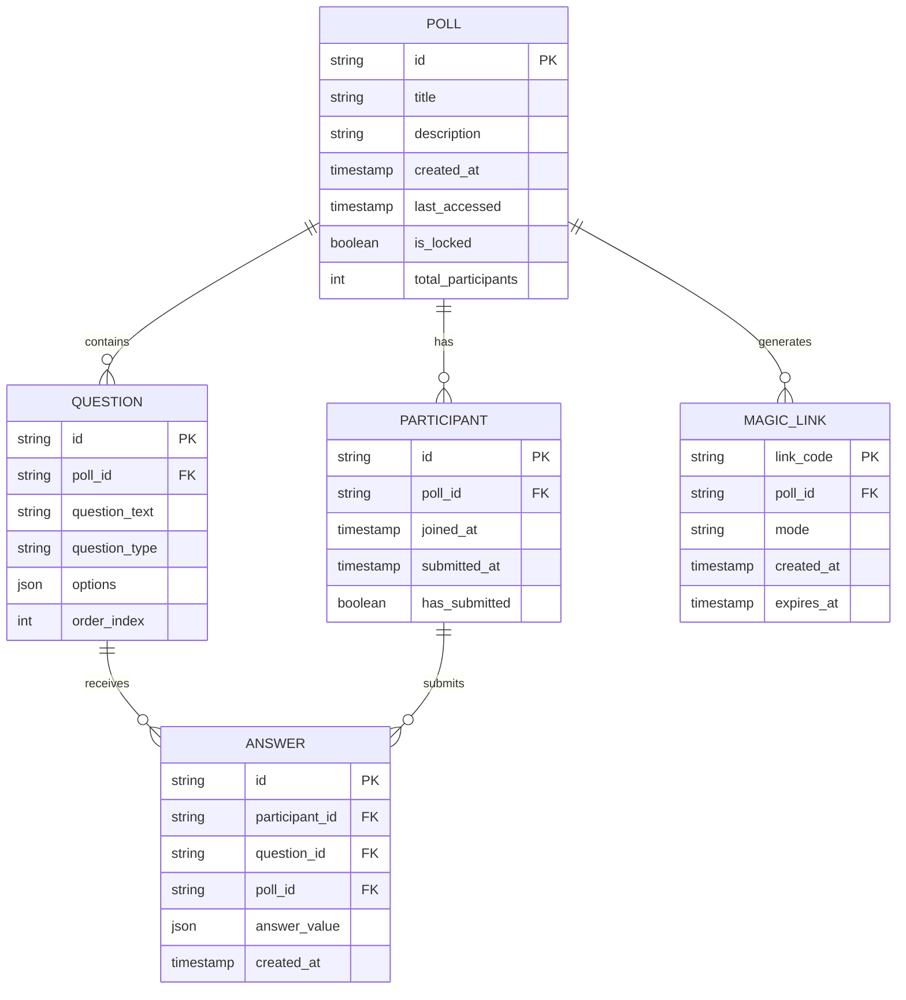
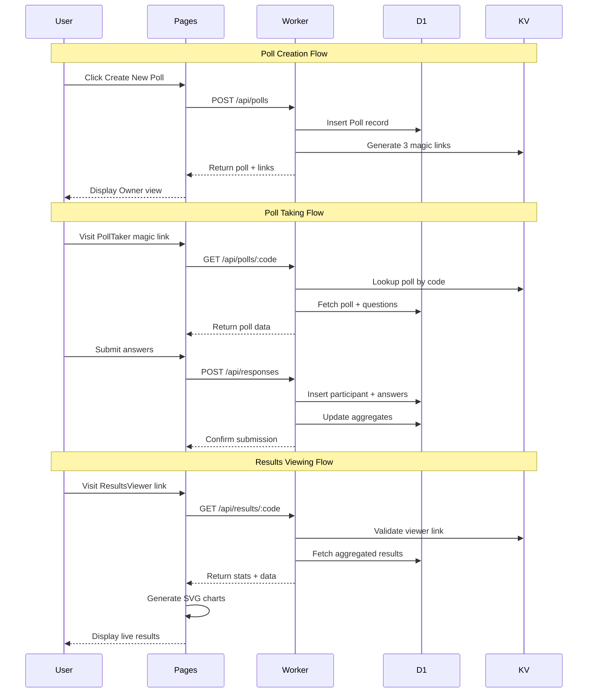

# DisposaPoll Development Plan

## Executive Summary

DisposaPoll is an ephemeral, anonymous polling application designed for real-time audience engagement. The application leverages Cloudflare's edge computing platform to deliver a fast, scalable, and cost-effective solution that automatically purges inactive polls after 30 days. The system uses magic links for access control without traditional authentication, supporting three distinct modes: Poll Owner, Results Viewer, and Poll Taker.

---

## High-Level Architecture

### System Architecture Diagram



### Entity Relationship Diagram



### Data Flow Diagram



---

## Cloudflare Technology Stack

### Recommended Services & Justifications

#### 1. Cloudflare Pages
**Purpose:** Frontend hosting for static HTML, JavaScript, and CSS

**Justification:**
- **Cost:** Free tier supports unlimited requests and bandwidth
- **Performance:** Global CDN distribution with edge caching
- **Scale:** Handles high concurrent users without configuration
- **Integration:** Native integration with Workers for dynamic functionality
- **Deployment:** Git-based deployments with automatic builds
- **Ephemerality:** No server state to manage; perfect for disposable polls

**Usage:**
- Serve static HTML templates for all three modes
- Host compiled Tailwind CSS
- Deliver client-side JavaScript for SVG chart generation
- Provide QR code generator library

#### 2. Cloudflare Workers
**Purpose:** API endpoints and business logic

**Justification:**
- **Cost:** Free tier provides 100k requests/day; Paid $5/month for 10M requests
- **Latency:** Sub-millisecond response times at the edge
- **Scale:** Automatically scales to handle traffic spikes
- **Stateless:** Perfect for ephemeral polling application
- **Compute:** Sufficient CPU for magic link generation, validation, aggregation

**API Endpoints:**
```
POST   /api/polls              - Create new poll
GET    /api/polls/:code        - Fetch poll by magic link code
PUT    /api/polls/:code        - Update poll (if not locked)
DELETE /api/polls/:code        - Delete poll (owner only)
POST   /api/polls/:code/copy   - Clone poll to new magic links

POST   /api/responses          - Submit poll answers
GET    /api/results/:code      - Fetch aggregated results

GET    /api/qr/:code           - Generate QR code data
POST   /api/validate           - Validate participant hasn't taken poll
```

#### 3. D1 Database
**Purpose:** Relational data storage for polls, questions, participants, and answers

**Justification:**
- **Cost:** Free tier includes 5GB storage, 5M reads/day, 100k writes/day
- **Data Model:** Complex relational data fits SQL better than KV
- **Queries:** Efficient JOIN operations for aggregating poll results
- **Consistency:** ACID transactions for preventing duplicate submissions
- **Scale:** Adequate for expected poll volume (thousands of concurrent polls)
- **Ephemerality:** Easy to cascade delete polls and all related data

**Tables:**
```sql
- polls
- questions
- participants
- answers
- (indexes on poll_id, participant_id, last_accessed)
```

#### 4. KV Store
**Purpose:** Magic link storage and fast lookups

**Justification:**
- **Cost:** Free tier includes 100k reads/day, 1k writes/day
- **Performance:** Ultra-low latency reads (<10ms globally)
- **TTL:** Native expiration support for 30-day auto-delete
- **Use Case:** Perfect for magic link code → poll ID mapping
- **Scale:** Handles high read volume for link validation

**KV Schema:**
```
Key: magic_link_code
Value: {
  pollId: string,
  mode: 'owner' | 'viewer' | 'taker',
  createdAt: timestamp
}
TTL: 30 days from last poll access
```

#### 5. Cron Triggers (Scheduled Workers)
**Purpose:** Automated cleanup of inactive polls

**Justification:**
- **Cost:** Included with Workers ($5/month plan)
- **Reliability:** Guaranteed execution at specified intervals
- **Automation:** No manual intervention for data expiration
- **Efficiency:** Batch processing of deletion operations

**Schedule:**
```
- Daily at 02:00 UTC: Check polls with last_accessed > 30 days
- Delete poll + cascade delete questions, participants, answers
- KV entries auto-expire via TTL
```

#### 6. Alternative: R2 Object Storage
**Not Recommended for MVP**

While R2 could store serialized poll aggregates, D1 provides sufficient performance for real-time aggregation queries. R2 would add complexity without meaningful benefit at expected scale. Consider R2 for Phase 6+ if storing historical analytics or archiving deleted polls.

### Technology Stack Summary

| Layer | Technology | Purpose | Cost (Estimated) |
|-------|-----------|---------|------------------|
| Frontend | Cloudflare Pages | Static hosting | Free |
| Styling | Tailwind CSS | UI framework | Free |
| Charts | SVG (D3.js or native) | Results visualization | Free |
| API | Cloudflare Workers | Business logic | $5/month |
| Database | D1 | Relational data | Free (under limits) |
| Cache/Links | KV | Magic link storage | Free (under limits) |
| Automation | Cron Triggers | Auto-delete | Included |
| **Total** | | | **~$5/month** |

---

## Data Models

### JSON Schemas

#### Poll Schema
```json
{
  "id": "uuid-v4",
  "title": "string (max 200 chars)",
  "description": "string (max 1000 chars, optional)",
  "createdAt": "ISO 8601 timestamp",
  "lastAccessed": "ISO 8601 timestamp",
  "isLocked": "boolean (true if responses exist)",
  "totalParticipants": "integer",
  "questions": [
    {
      "id": "uuid-v4",
      "questionText": "string (max 500 chars)",
      "questionType": "single-choice | multiple-choice | text | rating",
      "options": ["string array (for choice types)"],
      "orderIndex": "integer (0-based)"
    }
  ]
}
```

#### MagicLink Schema
```json
{
  "linkCode": "string (20-char alphanumeric)",
  "pollId": "uuid-v4 (foreign key)",
  "mode": "owner | viewer | taker",
  "createdAt": "ISO 8601 timestamp",
  "expiresAt": "ISO 8601 timestamp (30 days from last poll access)"
}
```

#### Participant Schema
```json
{
  "id": "uuid-v4",
  "pollId": "uuid-v4 (foreign key)",
  "sessionId": "string (browser fingerprint or temp ID)",
  "joinedAt": "ISO 8601 timestamp",
  "submittedAt": "ISO 8601 timestamp (null until submitted)",
  "hasSubmitted": "boolean"
}
```

#### Answer Schema
```json
{
  "id": "uuid-v4",
  "participantId": "uuid-v4 (foreign key)",
  "questionId": "uuid-v4 (foreign key)",
  "pollId": "uuid-v4 (foreign key, denormalized for queries)",
  "answerValue": {
    "type": "single | multiple | text | rating",
    "value": "string | array | number"
  },
  "createdAt": "ISO 8601 timestamp"
}
```

#### Aggregated Results Schema (Computed)
```json
{
  "pollId": "uuid-v4",
  "totalResponses": "integer",
  "questionResults": [
    {
      "questionId": "uuid-v4",
      "questionText": "string",
      "questionType": "string",
      "results": {
        "single-choice": {
          "optionCounts": {
            "Option A": 15,
            "Option B": 23
          },
          "percentages": {
            "Option A": 39.47,
            "Option B": 60.53
          }
        },
        "multiple-choice": {
          "optionCounts": { "...": "..." }
        },
        "text": {
          "responses": ["array of text answers"]
        },
        "rating": {
          "average": 4.2,
          "distribution": {
            "1": 2,
            "2": 5,
            "3": 10,
            "4": 15,
            "5": 20
          }
        }
      }
    }
  ]
}
```

### D1 Database Schema (SQL)

```sql
-- Polls table
CREATE TABLE polls (
    id TEXT PRIMARY KEY,
    title TEXT NOT NULL,
    description TEXT,
    created_at DATETIME DEFAULT CURRENT_TIMESTAMP,
    last_accessed DATETIME DEFAULT CURRENT_TIMESTAMP,
    is_locked BOOLEAN DEFAULT 0,
    total_participants INTEGER DEFAULT 0
);

CREATE INDEX idx_polls_last_accessed ON polls(last_accessed);

-- Questions table
CREATE TABLE questions (
    id TEXT PRIMARY KEY,
    poll_id TEXT NOT NULL,
    question_text TEXT NOT NULL,
    question_type TEXT NOT NULL, -- 'single' | 'multiple' | 'text' | 'rating'
    options TEXT, -- JSON array for choice types
    order_index INTEGER NOT NULL,
    FOREIGN KEY (poll_id) REFERENCES polls(id) ON DELETE CASCADE
);

CREATE INDEX idx_questions_poll ON questions(poll_id);

-- Participants table
CREATE TABLE participants (
    id TEXT PRIMARY KEY,
    poll_id TEXT NOT NULL,
    session_id TEXT NOT NULL,
    joined_at DATETIME DEFAULT CURRENT_TIMESTAMP,
    submitted_at DATETIME,
    has_submitted BOOLEAN DEFAULT 0,
    FOREIGN KEY (poll_id) REFERENCES polls(id) ON DELETE CASCADE,
    UNIQUE(poll_id, session_id) -- Prevent duplicate participation
);

CREATE INDEX idx_participants_poll ON participants(poll_id);
CREATE INDEX idx_participants_session ON participants(poll_id, session_id);

-- Answers table
CREATE TABLE answers (
    id TEXT PRIMARY KEY,
    participant_id TEXT NOT NULL,
    question_id TEXT NOT NULL,
    poll_id TEXT NOT NULL, -- Denormalized for efficient queries
    answer_value TEXT NOT NULL, -- JSON object
    created_at DATETIME DEFAULT CURRENT_TIMESTAMP,
    FOREIGN KEY (participant_id) REFERENCES participants(id) ON DELETE CASCADE,
    FOREIGN KEY (question_id) REFERENCES questions(id) ON DELETE CASCADE,
    FOREIGN KEY (poll_id) REFERENCES polls(id) ON DELETE CASCADE
);

CREATE INDEX idx_answers_poll ON answers(poll_id);
CREATE INDEX idx_answers_question ON answers(question_id);
CREATE INDEX idx_answers_participant ON answers(participant_id);
```

---

## Component Breakdown

### Frontend Components (Cloudflare Pages)

#### 1. Poll Creator / Owner Mode
**File:** `index.html` (with mode detection in JS)

**Features:**
- Poll title and description input
- Dynamic question builder (add/remove/reorder questions)
- Question type selector (single-choice, multiple-choice, text, rating)
- Option builder for choice-based questions
- Magic link display with copy buttons (Owner, Viewer, Taker)
- QR code generator for Viewer and Taker links
- Delete poll button (with confirmation)
- "Make Copy of Poll" button
- Lock indicator when poll has responses

**UI Components:**
- Header with magic link display
- Question list with drag-drop reordering
- Question type templates
- Modal for delete confirmation
- Toast notifications for actions

#### 2. Results Viewer Mode
**File:** `viewer.html` or dynamic mode detection

**Features:**
- Real-time poll statistics display
- SVG-based pie charts for single/multiple choice questions
- SVG-based bar charts for rating distributions
- Text response list view
- Auto-refresh mechanism (polling or SSE simulation)
- Participant count indicator
- QR code for poll taker link

**SVG Chart Components:**
- Pie chart generator (D3.js or custom SVG)
- Bar chart generator
- Legend with percentages
- Responsive sizing
- Color palette for visual distinction

#### 3. Poll Taker Mode
**File:** `poll.html` or dynamic mode detection

**Features:**
- Poll title and description display
- Question-by-question or all-at-once layout
- Input components per question type:
  - Radio buttons for single-choice
  - Checkboxes for multiple-choice
  - Textarea for text questions
  - 1-5 star selector for ratings
- Submit button with validation
- "Already taken" detection and message
- QR code display to share with nearby users
- Thank you screen post-submission

**Validation:**
- Client-side required field validation
- Session/fingerprint generation for duplicate prevention
- API call to check if user already participated

#### 4. Shared UI Components
- **Header Component:** Magic link display, copy buttons, mode indicator
- **QR Code Generator:** Using library like `qrcode.js` or `qr-code-styling`
- **Loading States:** Skeleton screens for data fetching
- **Error Boundaries:** User-friendly error messages
- **Responsive Layout:** Mobile-first Tailwind classes

### Backend Components (Cloudflare Workers)

#### 1. API Router Worker
**File:** `worker.js` (main entry point)

**Responsibilities:**
- Route incoming requests to appropriate handlers
- CORS header management
- Error handling and logging
- Rate limiting (basic IP-based)

#### 2. Poll Management Service
**Endpoints:**
- `POST /api/polls` - Create new poll with questions
- `GET /api/polls/:code` - Fetch poll by magic link
- `PUT /api/polls/:code` - Update poll (owner only, if not locked)
- `DELETE /api/polls/:code` - Delete poll and all data (owner only)
- `POST /api/polls/:code/copy` - Clone poll with new magic links

**Business Logic:**
- Generate 3 magic links on creation
- Validate owner permissions
- Lock poll when first response submitted
- Update `last_accessed` timestamp on every access
- Cascade delete to KV when poll deleted

#### 3. Magic Link Service
**Functions:**
- Generate cryptographically secure random codes
- Store code → poll ID + mode mapping in KV
- Validate link codes on requests
- Return mode and poll ID for routing
- Update KV TTL on poll access (reset 30-day countdown)

**KV Operations:**
```javascript
// Store magic link
await env.MAGIC_LINKS.put(linkCode, JSON.stringify({
  pollId,
  mode,
  createdAt: Date.now()
}), { expirationTtl: 2592000 }); // 30 days

// Retrieve and validate
const linkData = await env.MAGIC_LINKS.get(linkCode, 'json');
```

#### 4. Response Handler Service
**Endpoints:**
- `POST /api/responses` - Submit poll answers
- `POST /api/validate` - Check if user already participated

**Business Logic:**
- Create participant record with session ID
- Insert all answers in transaction
- Update poll `total_participants` count
- Lock poll (set `is_locked = true`)
- Prevent duplicate submissions via session ID

**Session Management:**
- Generate browser fingerprint (IP + User-Agent hash)
- Store in participant table
- Check uniqueness before allowing submission

#### 5. Results Aggregation Service
**Endpoints:**
- `GET /api/results/:code` - Get aggregated poll results

**Business Logic:**
- Validate viewer or owner magic link
- Query answers grouped by question
- Calculate percentages for choice questions
- Return formatted JSON for SVG rendering
- Update poll `last_accessed` timestamp

**Optimization:**
- Use indexed queries on `poll_id`
- Cache aggregated results briefly (30s) for high-traffic polls
- Consider Workers KV for aggregate cache if needed

#### 6. Scheduled Cleanup Worker
**File:** `cleanup.js` (scheduled worker)

**Schedule:** Daily at 02:00 UTC

**Logic:**
```sql
DELETE FROM polls 
WHERE last_accessed < datetime('now', '-30 days');
```

**Cascade:** D1 foreign keys handle dependent deletions

**KV:** Entries auto-expire via TTL, no manual cleanup needed

---

## Phased Implementation Roadmap

### Phase 1: Basic Poll Creation & Storage
**Goal:** Enable users to create polls and persist them

**Tasks:**
- Set up Cloudflare account and Wrangler CLI
- Initialize D1 database with schema
- Initialize KV namespace for magic links
- Create basic Cloudflare Pages site structure
- Implement poll creation form (HTML + Tailwind)
- Build Worker endpoint: `POST /api/polls`
  - Generate poll ID
  - Create 3 magic links (owner, viewer, taker)
  - Store in D1 and KV
  - Return magic links to frontend
- Implement magic link storage in KV
- Test poll creation flow end-to-end

**Deliverables:**
- Working poll creation interface
- Poll data stored in D1
- Magic links generated and stored in KV
- Basic Owner mode view showing magic links

---

### Phase 2: Magic Links & Mode Routing
**Goal:** Enable access control via magic links with three distinct modes

**Tasks:**
- Implement magic link detection in frontend
  - Parse URL for link code
  - Call API to fetch poll and mode
- Build Worker endpoint: `GET /api/polls/:code`
  - Lookup code in KV
  - Validate link exists
  - Return poll data + mode
  - Update `last_accessed` timestamp
- Create Owner Mode interface
  - Display magic links with copy buttons
  - Show poll details (read-only if locked)
  - Add delete poll button
  - Add "Make Copy" button (stub for now)
- Create Poll Taker Mode interface
  - Display poll title and questions
  - Render appropriate input for each question type
  - Implement duplicate submission prevention
- Build Worker endpoint: `POST /api/validate`
  - Generate session fingerprint
  - Check if participant exists for this poll + session
- Test all three magic link modes

**Deliverables:**
- URL-based mode routing working
- Owner, Viewer, Taker modes render correctly
- Copy to clipboard functionality
- Session-based duplicate prevention

---

### Phase 3: Poll Response Submission & Real-Time Results
**Goal:** Allow users to take polls and view live results

**Tasks:**
- Implement poll submission logic
  - Client-side form validation
  - Build Worker endpoint: `POST /api/responses`
  - Create participant record
  - Insert answers for all questions
  - Lock poll on first submission
- Build Results Viewer Mode interface
  - Create SVG pie chart component
  - Create SVG bar chart component
  - Implement layout for different question types
- Build Worker endpoint: `GET /api/results/:code`
  - Aggregate answers by question
  - Calculate percentages and distributions
  - Return formatted JSON
- Implement auto-refresh in Viewer mode
  - Polling every 5 seconds
  - Update charts with new data
- Add participant count display
- Test submission and real-time updates

**Deliverables:**
- Functional poll taking flow
- SVG charts rendering poll results
- Real-time updates in Viewer mode
- Poll locking after first response

---

### Phase 4: QR Codes, Polish, Advanced Features
**Goal:** Add QR code generation, copy poll feature, and UI refinements

**Tasks:**
- Integrate QR code library (qrcode.js)
- Generate QR codes for Taker and Viewer links
  - Display in Owner mode
  - Display in Viewer mode
  - Display in Taker mode post-submission
- Implement "Make Copy of Poll" feature
  - Clone poll definition (no responses)
  - Generate new magic links
  - Redirect to new Owner mode
- Implement poll deletion
  - Build Worker endpoint: `DELETE /api/polls/:code`
  - Add confirmation modal
  - Cascade delete in D1
  - Remove KV entries
- Add edit poll functionality (when not locked)
  - Build Worker endpoint: `PUT /api/polls/:code`
  - Enable/disable based on `is_locked` flag
- UI/UX polish
  - Loading states
  - Error handling
  - Toast notifications
  - Responsive design testing
- Add question reordering (drag-drop)

**Deliverables:**
- QR code display in all modes
- Working copy poll feature
- Delete poll functionality
- Edit poll (when unlocked)
- Polished, responsive UI

---

### Phase 5: Auto-Delete & Scheduled Cleanup
**Goal:** Implement 30-day auto-expiration of inactive polls

**Tasks:**
- Create scheduled Worker for cleanup
  - Configure cron trigger (daily at 02:00 UTC)
  - Query polls with `last_accessed > 30 days`
  - Delete polls (cascade handles dependencies)
- Set KV TTL on magic link creation (30 days)
- Implement "last accessed" tracking
  - Update timestamp on every poll access (any mode)
  - Factor into KV TTL reset (re-put with new TTL)
- Add KV TTL reset logic
  - When poll accessed, re-write magic links with fresh 30-day TTL
- Test cleanup worker locally with Wrangler
- Deploy scheduled worker to production
- Test end-to-end expiration flow

**Deliverables:**
- Scheduled cleanup worker running daily
- KV auto-expiration via TTL
- Last accessed tracking functional
- TTL reset on poll access

---

## Risk Analysis

### Technical Risks

| Risk | Impact | Likelihood | Mitigation Strategy |
|------|--------|------------|-------------------|
| **Real-time sync complexity** | High | Medium | Use client-side polling (5s intervals) instead of WebSockets/SSE for MVP; consider Durable Objects for WebSocket support in future |
| **Duplicate submission prevention** | High | Medium | Implement session fingerprinting (IP + User-Agent hashed); store in participant table with unique constraint; consider more robust fingerprinting library if needed |
| **D1 query performance at scale** | Medium | Low | Add indexes on `poll_id`, `last_accessed`; use denormalized `poll_id` in answers table; cache aggregated results in KV for high-traffic polls |
| **KV eventual consistency** | Medium | Low | Accept eventual consistency for magic link lookups (typically <10ms); use D1 for critical consistency needs (duplicate prevention) |
| **Magic link collisions** | High | Very Low | Use 20-character alphanumeric codes (62^20 combinations); implement uniqueness check on generation; retry on collision |
| **Browser fingerprint unreliability** | Medium | Medium | Combine multiple signals (IP, User-Agent, screen size); accept some false positives; provide owner manual override in future |
| **SVG chart rendering performance** | Low | Low | Limit chart updates to 5s polling; use efficient SVG rendering; consider canvas fallback for >1000 data points |
| **Cron trigger reliability** | Low | Very Low | Cloudflare cron triggers are highly reliable; add logging and monitoring; manual cleanup API endpoint as backup |

### Business/Product Risks

| Risk | Impact | Mitigation |
|------|--------|-----------|
| **Users forgetting magic links** | Medium | Provide prominent copy buttons; show QR codes; consider optional email backup |
| **Accidental poll deletion** | High | Require confirmation modal; implement soft delete with 7-day grace period (future) |
| **Abuse/spam polling** | Medium | Implement rate limiting; add basic CAPTCHA on poll creation (future) |
| **Data privacy concerns** | High | No PII collected; document privacy policy; offer immediate deletion via Owner mode |

---

## Assumptions

### Technical Assumptions
1. **Browser Support:** Modern browsers with ES6+ JavaScript, SVG, and localStorage support
2. **No Authentication:** Magic links are sufficient for access control; no user accounts needed
3. **Client-Side Rendering:** All UI rendering happens in browser; no SSR required
4. **Session Fingerprinting:** IP + User-Agent hash provides sufficient duplicate detection for MVP
5. **Cloudflare Free/Paid Tier:** $5/month Workers plan sufficient for expected traffic
6. **D1 Performance:** SQLite via D1 can handle expected query load (<100k polls active)
7. **KV Latency:** <50ms reads acceptable for magic link validation
8. **Network Reliability:** Users have stable internet for real-time polling experience

### Product Assumptions
1. **Use Case:** Primarily real-time, in-person polling (conferences, classrooms)
2. **Scale:** Max 1000 concurrent participants per poll (99th percentile)
3. **Poll Longevity:** Most polls inactive after event (hours), 30-day retention sufficient
4. **Mobile Usage:** 70%+ of poll takers on mobile devices
5. **QR Code Scanning:** Users have QR scanner app or camera app with QR support
6. **No Historical Data:** Users don't need to access deleted polls; ephemeral is acceptable

---

## Dependencies

### External Services
- **Cloudflare Account:** Required (free tier sufficient for development)
- **Wrangler CLI:** Required for local development and deployment
- **Node.js/npm:** Required for Wrangler and build tools
- **Git:** Required for version control and Pages deployment

### Libraries & Tools
- **Tailwind CSS:** Frontend styling framework
- **QR Code Library:** `qrcode.js` or similar for QR generation
- **SVG Chart Library:** Options:
  - D3.js (comprehensive but heavy)
  - Chart.js with SVG renderer
  - Custom vanilla JavaScript SVG generation (lightweight)
- **UUID Library:** `uuid` or `crypto.randomUUID()` for ID generation
- **Build Tool:** Vite or Webpack for asset bundling (optional for Pages)

### Cloudflare Services
- Cloudflare Pages (static hosting)
- Cloudflare Workers (API layer)
- D1 Database (relational storage)
- KV Store (magic link storage)
- Cron Triggers (scheduled cleanup)

---

## Next Steps

### Immediate Actions (Pre-Development)
1. **Set up Cloudflare account** and verify access
2. **Install Wrangler CLI** (`npm install -g wrangler`)
3. **Authenticate Wrangler** with Cloudflare account
4. **Create D1 database** via Wrangler CLI
5. **Create KV namespace** for magic links
6. **Initialize Git repository** for version control
7. **Set up project structure** (frontend/, backend/, docs/)

### Development Kickoff (Phase 1)
1. Implement D1 schema (polls, questions tables)
2. Create basic HTML template with Tailwind CDN
3. Build Worker with single endpoint: `POST /api/polls`
4. Test poll creation and data persistence
5. Verify magic link generation and KV storage

### Developer Handoff Checklist
- [ ] Cloudflare account credentials shared
- [ ] Wrangler CLI installed and authenticated
- [ ] D1 database created and schema documented
- [ ] KV namespace created
- [ ] Git repository initialized
- [ ] Development plan reviewed and approved
- [ ] Phase 1 tasks assigned and prioritized

---

## Appendix

### Recommended Cloudflare Commands

```bash
# Install Wrangler
npm install -g wrangler

# Login to Cloudflare
wrangler login

# Create D1 database
wrangler d1 create disposapoll-db

# Apply schema to D1
wrangler d1 execute disposapoll-db --file=./schema.sql

# Create KV namespace
wrangler kv:namespace create "MAGIC_LINKS"

# Create production KV namespace
wrangler kv:namespace create "MAGIC_LINKS" --preview=false

# Local development (Workers)
wrangler dev

# Deploy Worker
wrangler deploy

# Deploy Pages (from frontend directory)
wrangler pages deploy ./dist

# Create scheduled worker
wrangler init cleanup-worker --type cron

# Test scheduled worker locally
wrangler dev --test-scheduled
```

### Estimated Resource Usage (First 3 Months)

**Assumptions:**
- 500 polls created per month
- Average 50 participants per poll
- 5 questions per poll
- Average poll lifetime: 2 days active

**D1 Usage:**
- Polls: 500 rows/month
- Questions: 2,500 rows/month
- Participants: 25,000 rows/month
- Answers: 125,000 rows/month
- **Total:** ~150k rows/month, well within free tier

**KV Usage:**
- Magic links: 1,500 keys (3 per poll)
- Reads: ~250k/month (validation requests)
- Writes: ~1.5k/month (poll creation)
- **Status:** Within free tier

**Workers Usage:**
- Requests: ~500k/month (poll loads + submissions + results)
- CPU time: <1ms per request
- **Status:** Within $5/month paid tier

**Total Cost:** $5/month (Workers paid plan)

---

## Conclusion

This development plan provides a comprehensive roadmap for building DisposaPoll using Cloudflare's edge computing platform. The phased approach ensures iterative delivery of value, starting with core poll creation and progressing through advanced features like QR codes and auto-deletion.

The chosen technology stack leverages Cloudflare's strengths—global edge performance, generous free tiers, and seamless integration—to deliver a fast, scalable, and cost-effective solution. The architecture supports the ephemeral nature of the polls while maintaining data consistency and user experience.

With clear data models, well-defined API contracts, and detailed component specifications, development teams can proceed confidently through each phase, building a robust polling application that meets the unique requirements of real-time, anonymous audience engagement.
